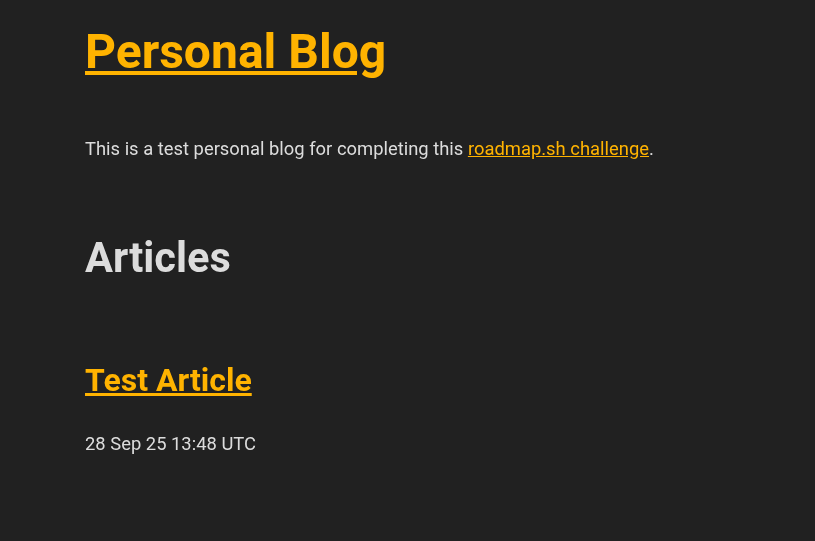
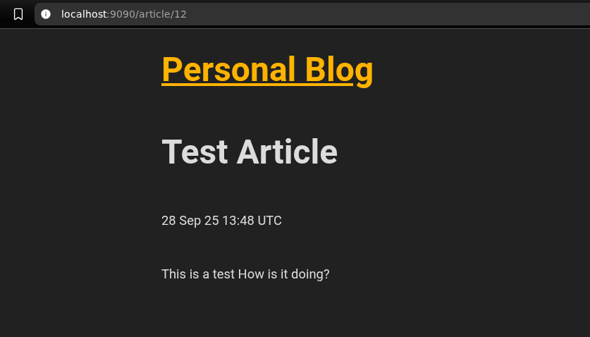
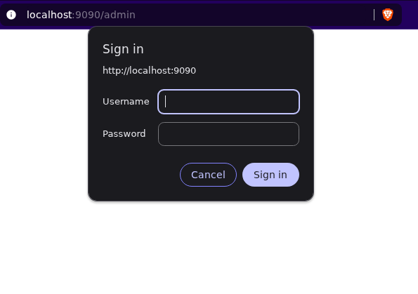
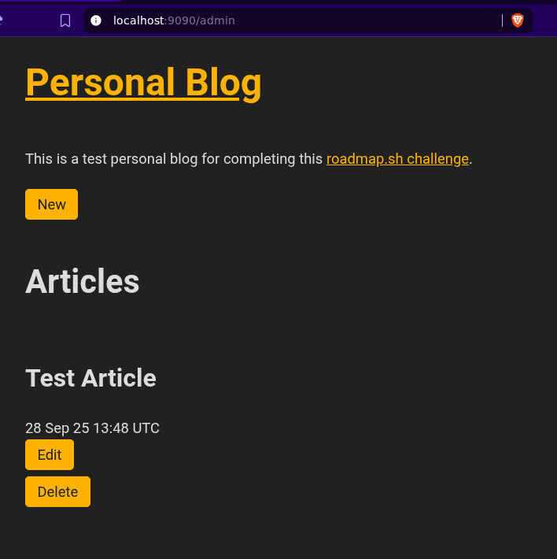
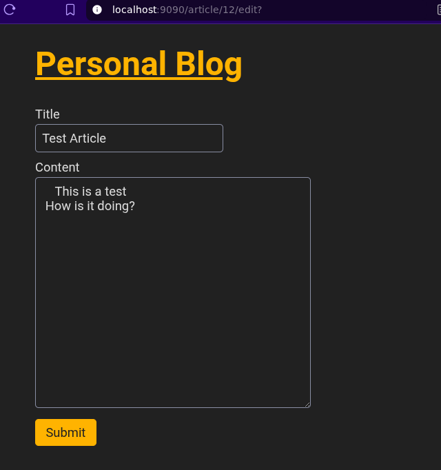

# Personal Blog Project

This project follows the guidelines set out in [this roadmaps.sh project](https://roadmap.sh/projects/personal-blog).
This web app allows a user to deploy a really simple blogging application where they can

1. Have a homepage for users to see all the blog articles

2. Click on the article and view the contents.

3. Go to an admin page (protected by basic authentication) where you can add, edit, delete articles

## Technology

I built this web application using Go.

For storing the articles, I used a SQLite database. All of the interactions with the database are in `models.go`.

I implemented the basic authentication in a simple middleware function in `middleware.go`.

The html is rendered using the standard library's html/template.

I didn't prioritize aesthetics, so I used [simple css](https://simplecss.org/) to augment the css from looking terrible to ok.
